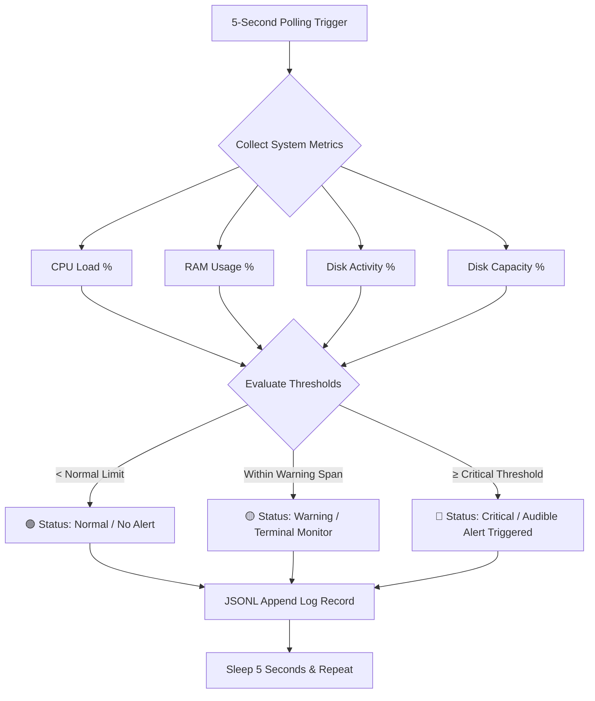
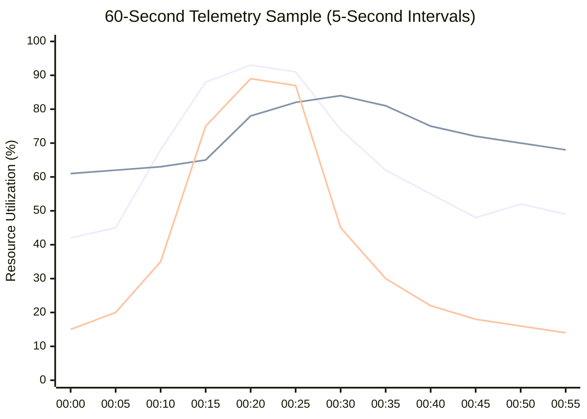

# System Performance & Health Monitoring Dashboard
**Raw Metric Data, Color-Coded Alert Frameworks & Historical Telemetry Visuals**

---

### 1. Monitoring Subsystems & Core Metric Inventory

<table style="width: 100%; border-collapse: collapse; margin-bottom: 25px; font-family: sans-serif;">
  <thead>
    <tr style="background-color: #1a4b75; color: #ffffff; text-align: left;">
      <th style="padding: 10px; border: 1px solid #dcdcdc; width: 20%;">Resource Category</th>
      <th style="padding: 10px; border: 1px solid #dcdcdc; width: 35%;">Key Metrics Displayed</th>
      <th style="padding: 10px; border: 1px solid #dcdcdc; width: 45%;">Operational Value & Diagnostic Purpose</th>
    </tr>
  </thead>
  <tbody>
    <tr style="background-color: #dcf1de; color: #111111;">
      <td style="padding: 10px; border: 1px solid #dcdcdc; font-weight: bold; vertical-align: top;">3.1 CPU Monitoring</td>
      <td style="padding: 10px; border: 1px solid #dcdcdc; vertical-align: top;">
        • CPU utilization percentage (used) 
        • CPU availability percentage (free) 
        • Identification of top CPU-consuming processes
      </td>
      <td style="padding: 10px; border: 1px solid #dcdcdc; vertical-align: top;">
        Determines compute load, flags runaway background processes, and validates if processor saturation is degrading system responsiveness.
      </td>
    </tr>
    <tr style="background-color: #fef4cf; color: #111111;">
      <td style="padding: 10px; border: 1px solid #dcdcdc; font-weight: bold; vertical-align: top;">3.2 Memory (RAM) Monitoring</td>
      <td style="padding: 10px; border: 1px solid #dcdcdc; vertical-align: top;">
        • Total installed RAM 
        • Currently used RAM 
        • Available free RAM 
        • Identification of top memory-consuming processes
      </td>
      <td style="padding: 10px; border: 1px solid #dcdcdc; vertical-align: top;">
        Detects memory pressure, isolates memory leak culprits, and prevents service instability or OOM crash events.
      </td>
    </tr>
    <tr style="background-color: #ffdada; color: #111111;">
      <td style="padding: 10px; border: 1px solid #dcdcdc; font-weight: bold; vertical-align: top;">3.3 Disk Activity Monitoring</td>
      <td style="padding: 10px; border: 1px solid #dcdcdc; vertical-align: top;">
        • Current disk active time percentage 
        • Read throughput speed (MB/s) 
        • Write throughput speed (MB/s) 
        • Identification of top disk I/O-consuming processes
      </td>
      <td style="padding: 10px; border: 1px solid #dcdcdc; vertical-align: top;">
        Reveals storage subsystem load, detects excessive disk operations per application, and diagnoses throughput bottlenecks.
      </td>
    </tr>
    <tr style="background-color: #f0f4f8; color: #111111;">
      <td style="padding: 10px; border: 1px solid #dcdcdc; font-weight: bold; vertical-align: top;">3.4 Disk Capacity Monitoring</td>
      <td style="padding: 10px; border: 1px solid #dcdcdc; vertical-align: top;">
        • Total storage capacity per drive 
        • Remaining free space per drive 
        • Usage percentage per drive
      </td>
      <td style="padding: 10px; border: 1px solid #dcdcdc; vertical-align: top;">
        Tracks drive volume consumption, guides data purge/expansion, and prevents write crashes on saturated disks.
      </td>
    </tr>
  </tbody>
</table>

---

### 2. Overall Health Status Color Matrix

<table style="width: 100%; border-collapse: collapse; margin-bottom: 25px; font-family: sans-serif;">
  <thead>
    <tr style="background-color: #1a4b75; color: #ffffff; text-align: left;">
      <th style="padding: 10px; border: 1px solid #dcdcdc; width: 15%;">Color</th>
      <th style="padding: 10px; border: 1px solid #dcdcdc; width: 20%;">Status</th>
      <th style="padding: 10px; border: 1px solid #dcdcdc; width: 65%;">Description & Operational Guidance</th>
    </tr>
  </thead>
  <tbody>
    <tr style="background-color: #dcf1de; color: #111111;">
      <td style="padding: 10px; border: 1px solid #dcdcdc; font-weight: bold;">Green</td>
      <td style="padding: 10px; border: 1px solid #dcdcdc; font-weight: bold;">Normal</td>
      <td style="padding: 10px; border: 1px solid #dcdcdc;">System is operating within acceptable parameters. No action required.</td>
    </tr>
    <tr style="background-color: #fef4cf; color: #111111;">
      <td style="padding: 10px; border: 1px solid #dcdcdc; font-weight: bold;">Yellow</td>
      <td style="padding: 10px; border: 1px solid #dcdcdc; font-weight: bold;">Warning</td>
      <td style="padding: 10px; border: 1px solid #dcdcdc;">Resource is under elevated load. Monitor closely and be prepared to act.</td>
    </tr>
    <tr style="background-color: #ffdada; color: #111111;">
      <td style="padding: 10px; border: 1px solid #dcdcdc; font-weight: bold;">Red</td>
      <td style="padding: 10px; border: 1px solid #dcdcdc; font-weight: bold;">Critical</td>
      <td style="padding: 10px; border: 1px solid #dcdcdc;">Resource has exceeded critical thresholds. Immediate attention may be required.</td>
    </tr>
  </tbody>
</table>

---

### 3. Subsystem Threshold & Audible Alert Matrix

#### CPU Utilization Thresholds
<table style="width: 100%; border-collapse: collapse; margin-bottom: 25px; font-family: sans-serif;">
  <thead>
    <tr style="background-color: #1a4b75; color: #ffffff; text-align: left;">
      <th style="padding: 10px; border: 1px solid #dcdcdc; width: 20%;">Status</th>
      <th style="padding: 10px; border: 1px solid #dcdcdc; width: 35%;">Usage Range</th>
      <th style="padding: 10px; border: 1px solid #dcdcdc; width: 45%;">Audible Alert Trigger</th>
    </tr>
  </thead>
  <tbody>
    <tr style="background-color: #dcf1de; color: #111111;">
      <td style="padding: 10px; border: 1px solid #dcdcdc;">Green</td>
      <td style="padding: 10px; border: 1px solid #dcdcdc;">Below 75%</td>
      <td style="padding: 10px; border: 1px solid #dcdcdc;">No alert</td>
    </tr>
    <tr style="background-color: #fef4cf; color: #111111;">
      <td style="padding: 10px; border: 1px solid #dcdcdc;">Yellow</td>
      <td style="padding: 10px; border: 1px solid #dcdcdc;">75% – 89%</td>
      <td style="padding: 10px; border: 1px solid #dcdcdc;">No alert – monitor closely</td>
    </tr>
    <tr style="background-color: #ffdada; color: #111111;">
      <td style="padding: 10px; border: 1px solid #dcdcdc;">Red</td>
      <td style="padding: 10px; border: 1px solid #dcdcdc;">90% and above</td>
      <td style="padding: 10px; border: 1px solid #dcdcdc; font-weight: bold;">Audible alert triggered</td>
    </tr>
  </tbody>
</table>

#### RAM (Memory) Utilization Thresholds
<table style="width: 100%; border-collapse: collapse; margin-bottom: 25px; font-family: sans-serif;">
  <thead>
    <tr style="background-color: #1a4b75; color: #ffffff; text-align: left;">
      <th style="padding: 10px; border: 1px solid #dcdcdc; width: 20%;">Status</th>
      <th style="padding: 10px; border: 1px solid #dcdcdc; width: 35%;">Usage Range</th>
      <th style="padding: 10px; border: 1px solid #dcdcdc; width: 45%;">Audible Alert Trigger</th>
    </tr>
  </thead>
  <tbody>
    <tr style="background-color: #dcf1de; color: #111111;">
      <td style="padding: 10px; border: 1px solid #dcdcdc;">Green</td>
      <td style="padding: 10px; border: 1px solid #dcdcdc;">Below 50%</td>
      <td style="padding: 10px; border: 1px solid #dcdcdc;">No alert</td>
    </tr>
    <tr style="background-color: #fef4cf; color: #111111;">
      <td style="padding: 10px; border: 1px solid #dcdcdc;">Yellow</td>
      <td style="padding: 10px; border: 1px solid #dcdcdc;">50% – 79%</td>
      <td style="padding: 10px; border: 1px solid #dcdcdc;">No alert – monitor closely</td>
    </tr>
    <tr style="background-color: #ffdada; color: #111111;">
      <td style="padding: 10px; border: 1px solid #dcdcdc;">Red</td>
      <td style="padding: 10px; border: 1px solid #dcdcdc;">80% and above</td>
      <td style="padding: 10px; border: 1px solid #dcdcdc; font-weight: bold;">Audible alert triggered</td>
    </tr>
  </tbody>
</table>

#### Disk Activity Thresholds
<table style="width: 100%; border-collapse: collapse; margin-bottom: 25px; font-family: sans-serif;">
  <thead>
    <tr style="background-color: #1a4b75; color: #ffffff; text-align: left;">
      <th style="padding: 10px; border: 1px solid #dcdcdc; width: 20%;">Status</th>
      <th style="padding: 10px; border: 1px solid #dcdcdc; width: 35%;">Usage Range</th>
      <th style="padding: 10px; border: 1px solid #dcdcdc; width: 45%;">Audible Alert Trigger</th>
    </tr>
  </thead>
  <tbody>
    <tr style="background-color: #dcf1de; color: #111111;">
      <td style="padding: 10px; border: 1px solid #dcdcdc;">Green</td>
      <td style="padding: 10px; border: 1px solid #dcdcdc;">Below 60%</td>
      <td style="padding: 10px; border: 1px solid #dcdcdc;">No alert</td>
    </tr>
    <tr style="background-color: #fef4cf; color: #111111;">
      <td style="padding: 10px; border: 1px solid #dcdcdc;">Yellow</td>
      <td style="padding: 10px; border: 1px solid #dcdcdc;">60% – 84%</td>
      <td style="padding: 10px; border: 1px solid #dcdcdc;">No alert – monitor closely</td>
    </tr>
    <tr style="background-color: #ffdada; color: #111111;">
      <td style="padding: 10px; border: 1px solid #dcdcdc;">Red</td>
      <td style="padding: 10px; border: 1px solid #dcdcdc;">85% and above</td>
      <td style="padding: 10px; border: 1px solid #dcdcdc; font-weight: bold;">Audible alert triggered</td>
    </tr>
  </tbody>
</table>

#### Disk Capacity Thresholds
<table style="width: 100%; border-collapse: collapse; margin-bottom: 25px; font-family: sans-serif;">
  <thead>
    <tr style="background-color: #1a4b75; color: #ffffff; text-align: left;">
      <th style="padding: 10px; border: 1px solid #dcdcdc; width: 20%;">Status</th>
      <th style="padding: 10px; border: 1px solid #dcdcdc; width: 35%;">Usage Range</th>
      <th style="padding: 10px; border: 1px solid #dcdcdc; width: 45%;">Audible Alert Trigger</th>
    </tr>
  </thead>
  <tbody>
    <tr style="background-color: #dcf1de; color: #111111;">
      <td style="padding: 10px; border: 1px solid #dcdcdc;">Green</td>
      <td style="padding: 10px; border: 1px solid #dcdcdc;">Below 80%</td>
      <td style="padding: 10px; border: 1px solid #dcdcdc;">No alert</td>
    </tr>
    <tr style="background-color: #fef4cf; color: #111111;">
      <td style="padding: 10px; border: 1px solid #dcdcdc;">Yellow</td>
      <td style="padding: 10px; border: 1px solid #dcdcdc;">80% – 89%</td>
      <td style="padding: 10px; border: 1px solid #dcdcdc;">No alert – monitor closely</td>
    </tr>
    <tr style="background-color: #ffdada; color: #111111;">
      <td style="padding: 10px; border: 1px solid #dcdcdc;">Red</td>
      <td style="padding: 10px; border: 1px solid #dcdcdc;">90% and above</td>
      <td style="padding: 10px; border: 1px solid #dcdcdc; font-weight: bold;">Audible alert triggered</td>
    </tr>
  </tbody>
</table>

---

### 4. Consolidated Threshold Comparison Matrix

| Hardware Resource Subsystem | 🟢 Normal Level | 🟡 Warning Level | 🔴 Critical Level | Alert Trigger Mode |
| :--- | :---: | :---: | :---: | :---: |
| **CPU Utilization** | `< 75%` | `75% – 89%` | **`≥ 90%`** | Audible Tone + Red Text |
| **RAM (Memory) Usage** | `< 50%` | `50% – 79%` | **`≥ 80%`** | Audible Tone + Red Text |
| **Disk Activity (Busy %)** | `< 60%` | `60% – 84%` | **`≥ 85%`** | Audible Tone + Red Text |
| **Disk Capacity (Storage Full %)** | `< 80%` | `80% – 89%` | **`≥ 90%`** | Audible Tone + Red Text |

---

### 5. Architectural & System Telemetry Graphs

#### Subsystem Alert Progression & Escalation Flow

---

#### 60-Second Real-Time Telemetry Trend Graph

---

#### Resource Critical Level Benchmark Graph

```mermaid
xychart-beta
    title "Alert Boundary Threshold Comparison (%)"
    x-axis ["CPU Load", "RAM Usage", "Disk Activity", "Disk Capacity"]
    y-axis "Threshold Percentage (%)" 0 --> 100
    bar "Normal Upper Bound" [75, 50, 60, 80]
    bar "Critical Threshold (Audible)" [90, 80, 85, 90]
```

---

### 6. Historical Telemetry JSONL Log Sample (Raw Records)

| Timestamp | CPU % | RAM % | Disk % | Top CPU Task | Top RAM Task | Top I/O Task | State |
| :--- | :---: | :---: | :---: | :--- | :--- | :--- | :---: |
| `2026-09-08T16:00:00Z` | 42% | 61% | 15% | `System` | `sqlservr.exe` | `svchost.exe` | 🟢 OK |
| `2026-09-08T16:00:15Z` | 88% | 65% | 75% | `node.exe` | `sqlservr.exe` | `powershell.exe` | 🟡 WARN |
| `2026-09-08T16:00:20Z` | **93%** | 78% | **89%** | `node.exe` | `sqlservr.exe` | `node.exe` | 🔴 **CRIT** |
| `2026-09-08T16:00:25Z` | **91%** | **82%** | **87%** | `node.exe` | `java.exe` | `node.exe` | 🔴 **CRIT** |
| `2026-09-08T16:00:35Z` | 62% | **81%** | 30% | `System` | `java.exe` | `svchost.exe` | 🔴 **CRIT** |
| `2026-09-08T16:00:55Z` | 49% | 68% | 14% | `System` | `sqlservr.exe` | `svchost.exe` | 🟢 OK |